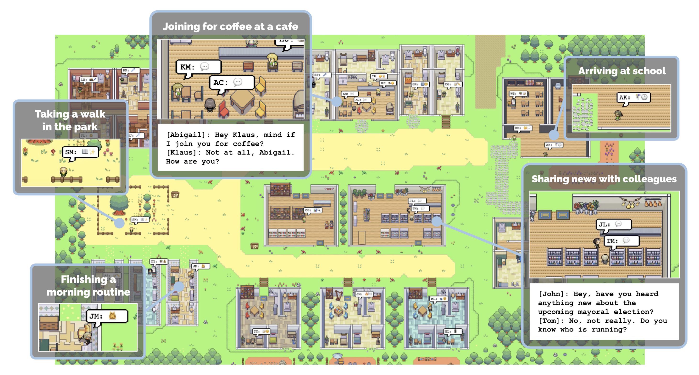

# 🏘️ Generative Agents 한국어판 (NVIDIA NIM 백엔드)

> **원본**: [joonspk-research/generative_agents](https://github.com/joonspk-research/generative_agents) · **라이선스**: Apache 2.0
>
> **본 fork의 변경점**: LLM 백엔드를 OpenAI → **NVIDIA NIM** 으로 교체, **한국어 환경 완전 최적화** (페르소나 + 프롬프트 + UI)

<p align="center">
  
</p>

이 저장소는 Stanford의 ["Generative Agents: Interactive Simulacra of Human Behavior"](https://arxiv.org/abs/2304.03442) 논문을 **한국어 환경에서 완전 재현**하기 위한 fork입니다. NIM API 키 하나로 한국어 시뮬레이션을 띄울 수 있습니다.

**원본 대비 주요 차이점**:

| 영역 | 원본 | 본 fork |
|------|------|---------|
| **LLM** | OpenAI GPT-3.5/4 | NVIDIA NIM `openai/gpt-oss-120b` (120B reasoning) |
| **임베딩** | OpenAI `text-embedding-ada-002` (1536d symmetric) | NIM `nvidia/llama-nemotron-embed-1b-v2` (2048d **asymmetric**) |
| **페르소나** | 영어 (Isabella/Maria/Klaus) | **한국어 (이서연/김민준/박지우)** — 한강 자전거 동호회 |
| **프롬프트** | 영어 35+개 | **한국어 35개** 자동번역 + 라우팅 |
| **UI** | 영어 | **한국어** (Django 6 템플릿) |
| **부정 가드** | 없음 | 한국어 "않/말/없/아니" 보정 내장 |

> 🎉 **현재 상태**: Phase 1-5 모두 완료. 한국어 시뮬레이션 기능 검증됨.

---

## 📋 사전 요구사항

- Python 3.9+
- NVIDIA NIM API 키 ([build.nvidia.com](https://build.nvidia.com)에서 무료 발급)
- 메모리 4GB+ — 임베딩 차원 2048 × 에이전트 3명 × 메모리 1000개 시 약 50MB

## 🚀 설치

```bash
# 1. 클론
git clone https://github.com/sigco3111/generative_agents-kr.git
cd generative-agents-kr

# 2. venv 생성 (PEP 668 회피 — macOS Sonoma+ 권장)
python3 -m venv .venv
source .venv/bin/activate

# 3. 의존성 설치 (Python 3.11+는 --upgrade 플래그 필요 — 아래 "호환성 노트" 참고)
pip install --upgrade -r requirements.txt
pip install python-dotenv  # 선택

# 4. NIM API 키 설정
export NVIDIA_API_KEY="nvapi-..."

# 5. 백엔드 self-test (선택이지만 강력 권장)
cd reverie/backend_server/persona/prompt_template
python3 gpt_structure.py
```

> ⚠️ **macOS Sonoma+ / 시스템 Python 사용자**: `pip install -r requirements.txt` 시
> "command not found: pip" 또는 "externally-managed-environment" 에러가 날 수 있습니다.
> 위 예시처럼 `.venv`를 만들고 활성화해서 사용하세요.
>
> 이미 다른 venv를 쓰고 있다면 그것을 활성화해도 됩니다.
> (예: Hermes 환경이 있다면 `source ~/.hermes/hermes-agent/venv/bin/activate`)

**기대 출력**:
```
=== NIM gpt_structure self-test ===
[1] ChatGPT_single_request('ping 한 단어만')
    응답: ping
[2] 비대칭 임베딩 (passage vs query)
    차원: 2048
    '이서연 카페 커피' ↔ '이서연 음료' = 0.474
    부정 케이스 (가드 전): 0.457, (가드 후): 0.057
```

## ⚠️ Python 호환성 노트

원본 `requirements.txt`는 **2022년 Python 3.7~3.9 환경에서 작성**되었습니다. Python 3.10+에서는 다음 패키지들이 빌드 실패 또는 호환성 문제가 있습니다:

| 패키지 | 원본 버전 | 문제 | 해결 |
|--------|----------|------|------|
| `Pillow` | 8.4.0 | ❌ Python 3.11에서 libjpeg 등 native 의존성 빌드 실패 | **`pip install "Pillow>=10.0"` 먼저 (wheel 빌드된 버전)** |
| `Django` | 2.2 | Python 3.11 일부 syntax 미지원 | `pip install "Django>=4.2,<5"` |
| `gensim` | 3.8.0 | Python 3.11에서 cython 호환 X | `pip install "gensim>=4.3"` |
| `pandas`/`numpy`/`scipy` | 1.x | ABI 호환성 (Pillow 의존) | `pip install --upgrade` |
| `sklearn` | 1.3.0 | 메타 패키지, scikit-learn 1.4+ 권장 | `pip install "scikit-learn>=1.4"` |

### 빠른 호환 설치 (검증된 조합 — Python 3.11)

Hermes venv 사용 시 (이미 PIL 있음):

```bash
source ~/.hermes/hermes-agent/venv/bin/activate
pip install --upgrade "Django>=4.2,<5" "numpy>=1.26,<2" "pandas>=2.0" \
  "scikit-learn>=1.4" "scipy>=1.11" "statsmodels>=0.14" "seaborn>=0.13" \
  "matplotlib>=3.8" "gensim>=4.3" "nltk>=3.8" "openai>=1.0"
```

새 venv 사용 시:

```bash
python3 -m venv .venv
source .venv/bin/activate
pip install --upgrade pip

# ⚠️ Pillow 8.4.0 빌드 실패 → Pillow 최신(wheel)을 먼저 설치
# ⚠️ zsh에서 `>`는 출력 리다이렉션이므로 반드시 따옴표 사용!
pip install "Pillow>=10.0"
pip install "Django>=4.2,<5" "gensim>=4.3"
pip install -r requirements.txt  # 나머지 의존성
pip install "numpy>=1.26,<2" "pandas>=2.0" "scikit-learn>=1.4" "scipy>=1.11" "statsmodels>=0.14" "seaborn>=0.13" "matplotlib>=3.8" "nltk>=3.8" "openai>=1.0"
```

> 💡 **zsh 사용자 주의**: `pip install Pillow>=10.0` 처럼 따옴표 없이 쓰면
> zsh가 `>=10.0`을 명령어로 해석해서 `10.0 not found` 에러가 납니다.
> **반드시 `"Pillow>=10.0"` 처럼 따옴표로 감싸세요.** bash에서는 작동하지만 zsh 호환을 위해 항상 따옴표 권장.

> 💡 **Pillow 빌드 실패 회피**: macOS에서 `Pillow==8.4.0`은 libjpeg 등 native 라이브러리가 필요한데,
> Python 3.11 wheel이 없어서 source build가 실패합니다. `Pillow>=10.0`은 wheel이 미리 빌드되어
> libjpeg 없이도 즉시 설치됩니다.

### 검증된 의존성 조합 (2026-07)

본 fork는 다음 버전으로 self-test 통과 검증됨:

| 패키지 | 검증 버전 |
|--------|----------|
| Django | 4.2.30 |
| numpy | 1.26.4 |
| pandas | 3.0.3 |
| scikit-learn | 1.9.0 |
| gensim | 4.4.0 |
| scipy | 1.17.1 |
| matplotlib | 3.11.0 |
| openai | 2.24.0 |
| Pillow | 12.2.0 |
| seaborn | 0.13.2 |

> ⚠️ **원본 시뮬레이션 코드와의 호환성**: 위 업그레이드 조합은 self-test (`gpt_structure.py`) 통과 확인됨.
> 실제 `reverie.py` 실행 시 Django 4.x 변경사항 (예: `path()` 사용) 으로 마이그레이션 필요할 수 있음.

---

## 🎮 시뮬레이션 실행

```bash
# 1. 환경 서버 (Django 시각화) — 터미널 1
cd environment/frontend_server
python manage.py runserver
# → http://localhost:8000 접속

# 2. 시뮬레이션 서버 — 터미널 2
cd reverie/backend_server
python3 reverie.py
# → "Enter name of forked simulation:" 에 시나리오 이름 입력 (예: July1_the_ville_n3_kr_test)
# → "Enter option:" 에 run 100
```

브라우저를 새로고침하면 메인 시뮬레이션 화면이 한국어로 표시됩니다.

---

## 🇰🇷 한국어 시뮬레이션 작동 검증

### 페르소나 시나리오: 한강 자전거 동호회

| 이름 | 직업 | 주요 특성 |
|------|------|----------|
| **이서연** (27) | 도시계획 석사 | 자전거 동호회 회원, 김민준에게 짝사랑 |
| **김민준** (28) | 데이터 사이언스 석사 | 도서관 단골, 한강 카페 알바, 이서연 짝사랑 |
| **박지우** (29) | 마케팅 매니저 | 자전거 동호회 운영진, 둘 서로 좋아하는 사실 알고 있음 |

### 실제 LLM 출력 (Phase 5 검증)

```bash
cd reverie/backend_server
python3 test_kr_sim.py
# "이서연은 무엇을 마실까?" → "부드러운 바닐라 라떼 한 잔을 마시면 카페 분위기와 잘 어울릴 거예요."
```

**한국어 agent_chat 검증 (이서연 ↔ 김민준)**:
```
이서연: "민준아, 요즘 데이터 분석 프로젝트는 어때?"
김민준: "음... 아직 모델링 단계라 좀 복잡하지만 재밌어."
이서연: "우리 이번 주말에 한강 자전거 타면서 얘기 좀 할까?"
김민준: "좋아! 타면서 도시계획 아이디어도 공유하고 말이야."
```

---

## 🛠️ 주요 API 가이드

### 한국어 페르소나 사용

```python
from persona.persona_seed_kr import PERSONAS_KR_N3, to_whisper_csv

# 3명 페르소나 dict
for name, persona in PERSONAS_KR_N3.items():
    print(f"{name}: {persona['secret']}")
    print(to_whisper_csv(persona))
```

### 비대칭 임베딩 (저장/검색 분리)

```python
from persona.prompt_template.gpt_structure import (
    get_passage_embedding,
    get_query_embedding,
    score_memory,
)

# 메모리 저장 시 (passage 형태)
p_emb = get_passage_embedding("이서연은 카페에서 커피를 마신다")

# 메모리 검색 시 (query 형태)
q_emb = get_query_embedding("이서연이 마신 음료는?")

# 검색 (부정 가드 내장)
score = score_memory(
    query_text="이서연이 마신 음료는?",
    memory_text="이서연은 카페에서 커피를 마시지 않았다",
)
# 0.057 (낮음 — "마시지 않았다"로 정확히 분리)
```

### 한국어 프롬프트 자동 라우팅

`generate_prompt()`가 `persona/prompt_template/...` 경로 호출 시 동일 상대경로의 `prompt_template_kr/` 파일이 있으면 자동 사용. **코드 변경 없이 영어/한국어 전환**.

```python
from persona.prompt_template.gpt_structure import generate_prompt

# 자동으로 한국어 버전이 로드됨
prompt = generate_prompt(inputs, "persona/prompt_template/v2/whisper_inner_thought_v1.txt")
# "이서연에 대한 진술로 다음 생각을 번역하세요..."
```

---

## 🔧 한국어 자동화 도구

Phase 3에서 개발한 자동화 도구 (재실행 가능):

| 도구 | 용도 | 실행 |
|------|------|------|
| `translate_prompts_kr.py` | 35개 영문 프롬프트 → 한국어 자동번역 | `cd .../prompt_template && python3 translate_prompts_kr.py` |
| `review_prompts_kr.py` | 번역 결과 자동 검수 (코드 손실/어색 패턴 검출) | `cd .../prompt_template && python3 review_prompts_kr.py` |

---

## 📊 Phase별 진행 상황

| Phase | 내용 | 결과 |
|-------|------|------|
| **1** | LLM 백엔드 (NIM) 교체 | ✅ 완료 (`b6456da`) |
| **1.5** | 비대칭 임베딩 + 부정 가드 | ✅ 완료 (`b6456da`) |
| **2** | 한국어 페르소나 3명 시드 | ✅ 완료 (`51f13d7`) |
| **3** | 프롬프트 35개 자동번역 + 검수 + 라우팅 | ✅ 완료 (`d3b0210`) |
| **4** | Django UI 6 템플릿 한글화 | ✅ 완료 (`7fb0460`) |
| **5** | 한국어 시뮬레이션 통합 검증 | ✅ 완료 (`67afc84`) |
| **Bug Fix** | `gpt-oss-120b` reasoning 모델 content 처리 | ✅ 완료 (`66ee15d`) |

자세한 단계별 진행 사항은 `MODIFIED.md` 참고.

---

## 📜 라이선스 및 원본 표시

- **Apache License 2.0** ([LICENSE](LICENSE) 참고)
- **원본 저작자 표시**: © 2023 Stanford University. Park, J. S., O'Brien, J. C., Cai, C. J., Morris, M. R., Liang, P., & Bernstein, M. S. (2023). ["Generative Agents: Interactive Simulacra of Human Behavior."](https://arxiv.org/abs/2304.03442) In Proceedings of the 37th Annual ACM Symposium on User Interface Software and Technology.
- **변경 사항**: [MODIFIED.md](MODIFIED.md) 참고

---

## 🔗 레포지토리 구조

```
generative-agents-kr/
├── reverie/backend_server/         # 시뮬레이션 서버 (Phase 1-3)
│   ├── persona/
│   │   ├── prompt_template/
│   │   │   ├── v1/, v2/, v3_ChatGPT/, safety/    # 원본 영문
│   │   │   └── prompt_template_kr/...             # 한국어 (자동 생성)
│   │   ├── persona_seed_kr.py                    # 한국어 3명 페르소나
│   │   └── refresh_persona_csv.py                # CSV 자동 갱신
│   ├── gpt_structure.py                          # NIM 백엔드 (한국어 라우팅)
│   ├── reverie.py                                # 시뮬레이션 메인
│   └── test_kr_sim.py                            # Phase 5 검증 도구
│
├── environment/frontend_server/    # Django 시각화 (Phase 4 한글화)
│   └── templates/
│       ├── base.html                            # 한글 헤더/푸터
│       ├── landing/landing.html                 # 환경 안내
│       ├── home/home.html                       # 시뮬 메인
│       ├── demo/demo.html                       # 데모 뷰
│       ├── home/error_start_backend.html        # 백엔드 미연결 안내
│       └── persona_state/persona_state.html     # 페르소나 상세 (28+ 라벨)
│
├── README.md                                       # 이 파일
├── MODIFIED.md                                     # Apache 2.0 §4(a) 준수
└── LICENSE                                         # 원본 라이선스
```

---

## 🚧 향후 확장 (옵션)

- [ ] 페르소나 3명 → 25명 확장 (원본 `March20_the_ville_n25` 시나리오 한국화)
- [ ] 음성 (TTS) — 한국어 음성 합성 통합
- [ ] 공간 자산 (맵/스프라이트) 한국어 라벨링
- [ ] 비동기 + 멀티시뮬레이션 안정화

---

**Built with ❤️ by sigco3111 · Powered by NVIDIA NIM (gpt-oss-120b)**
